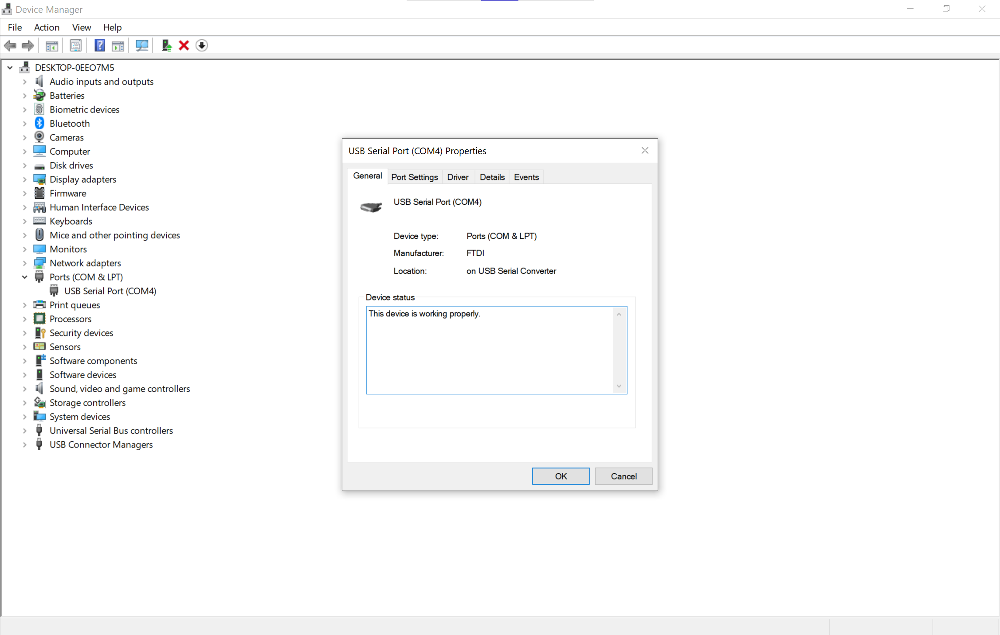
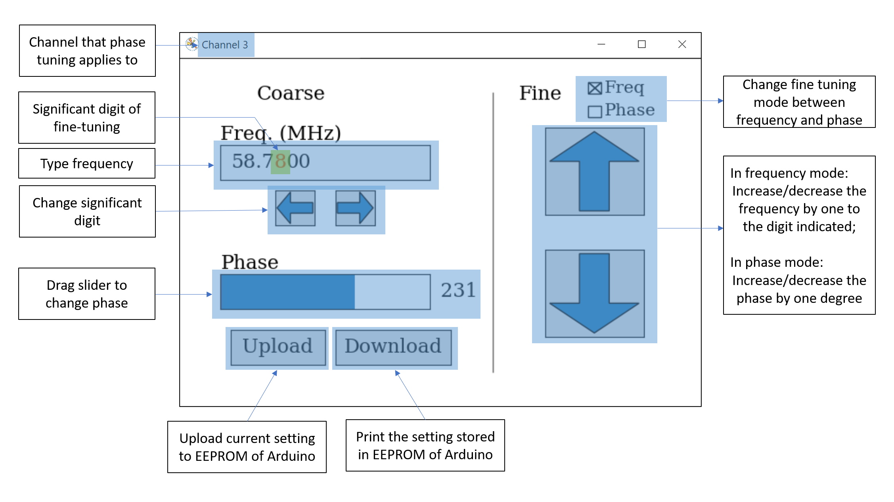

# AD9959-GUI
Python GUI for Arduino controlled AD9959 DDS board


## Problem

You want to determine the Serial Number column in the `current_settings.csv`. 

## Solution

1. `Win+R` >  `devmgmt.msc` to open Device Manager (or type the name in the search bar).
2. In `Ports (COM & LPT)` a list of of COM ports are found.
3. Unplug/re-plug the Arduino to determine which port is of interest and double click that entry. 



4. Go to `Details` > `Property` > `Device instance path`, the string in red box is what to put in the Serial Number column. 


---

## Problem

You want to tune for the PDH signal, the EOM and LO signals coming by two channels of DDS board. 

## Solution

Since in a PDH set-up, only the phase difference between EOM drive and LO matters, we can change the phase of LO while keeping that of EOM drive fixed. Assume LO on channel 3 and EOM drive on channel 0, this is achieved below. 

```python
# Assume the name of Arduino is 'local', LO on channel 3 and EOM drive on channel 0
DDSSingleChannelBack(DDSSingleChannelWriter('local', 3, [0]))
```

## Discussion

This scenario is what initiated the project, so most capabilities of the program focus on the ease of this process. 

The `DDSSingleChannelWriter` object expects 3 arguments as its input. Parameters are: 

```python
DDSSingleChannelWriter(name, channel, shared_channels)
```

- `name`: The "Name" column from `current_settings.csv`;
- `channel`: The channel that phase change applies to;
- `shared_channels`: The channels, apart from that specified in `channel`, that frequency change applies to.

In a PDH tuning scenario, `channel` and `shared_channels` refers to either LO/EOM drive. 

---

## Problem

After launching the program, you want to know what the buttons, textbox, slider, etc. do. 

## Solution

After running the script, a window would pop up. This is the playground of all tuning. An anatomy is as follows. 



A typical PDH tuning procedure is as follows: 

1. The EOM frequency is measured from spectrum analyzer and is around $58.78\,\mathrm{MHz}$. So the file `current_settings.csv` is edited with parameter saved. 
2. The script is run and the resonance peak is found by minimizing EOM reflection. A few clicks on the up/down button shows a trend and a minimum is found quickly. The script outputs tuning history to terminal.  


3. The PDH signal can be seen, but the phase is not correct. So the slider is dragged until most symmetric pattern is found. 


4. The parameters are deemed optimal so they should be stored in Arduino's EEPROM, which can be achieve by just clicking `Upload`. 
    

    
5. You want to make sure the upload is successful so click `Download`. 
    

    
6.  The tuning is finished so the window is closed and you're prompted to decided whether or not to upload the parameter to EEPROM. Since they're just uploaded, this time `No` is clicked.  
    


7. Finally, you're prompted to edit the entry `current_settings.csv`, such that it records the latest parameters stored in EEPROM.


---


## Problem

You want to make DDS board serve as a four-channel sine-wave generator. 

## Solution

Just create four UIs, one for each channel, as follows: 

```python
# Assume the name of Arduino is 'local'
for ch in range(4):
    DDSSingleChannelBack(DDSSingleChannelWriter('local', ch))
```

## Discussion

In this situation, upload feature needs to be used with care. The logic of uploading(updating) is this: for each instance of `DDSSingleChannelWriter` the frequency & phase of only `channel` and `shared_channels` are uploaded to EEPROM (updated to AD9959 chip). In our case, `channel=ch` and `shared_channels=[]`, so when `Upload` button is clicked, only one channel is updated to EEPROM. 

Note that although there's no restriction preventing you write something like: 

```python
# Channel 0, 1, 2 shares the same frequency; 
# and the phase/frequency of channel 1 and channel needs to be tuned simultaneously
DDSSingleChannelBack(DDSSingleChannelWriter('local', 1, [0, 1, 2]))
DDSSingleChannelBack(DDSSingleChannelWriter('local', 2, [0, 1, 2]))
```

It should be understood that updating frequency from one window does *not* affect the frequency in the other.  

Also note that if you have two boards named `local1` and `local2`, and you want to use them simultaneously, then two Python script can be created each controlling one board.
